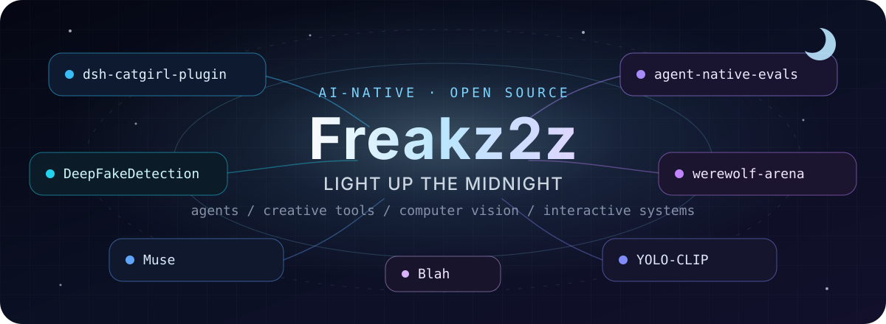

  

### AI-Native Developer · Student · Open-source Builder

把终端当作游乐场，把模型、工具和界面拼成真正能运行的作品。

Building agent systems, creative AI tools, computer vision projects, and playful experiments.

<a href="https://freakz2z.com"><b>Website</b></a>&nbsp;·&nbsp;<a href="https://github.com/Freakz2z?tab=repositories"><b>Repositories</b></a>&nbsp;·&nbsp;<a href="https://github.com/Limnov"><b>@Limnov</b></a>

  

 

<h2 align="center">What I'm Building</h2>

  我喜欢把一个有趣的问题一路做到可运行、可验证、可分享。 
  现在的探索集中在 <b>Agent 工具链</b>、<b>AI 应用</b>、<b>计算机视觉</b>和<b>互动体验</b>。

 

<h2 align="center">Selected Work</h2>

真实项目、实验和工具。点击项目名即可进入仓库。

<table align="center">
  <tr>
    <td align="center" width="50%">
      <h3><a href="https://github.com/Freakz2z/dsh-catgirl-plugin">dsh-catgirl-plugin</a></h3>
      
为 DeepSeek Harness 打造的 token 高效人格运行时，使用本地渲染与工具渐进披露保持能力和体验。

      <code>JavaScript</code> · <code>Agent Runtime</code> · <code>MIT</code>
    </td>
    <td align="center" width="50%">
      <h3><a href="https://github.com/Freakz2z/agent-native-evals">agent-native-evals</a></h3>
      
离线优先的 JSONL Agent 轨迹评测器，在没有模型和 API Key 的环境里验证工具调用、输出与预算。

      <code>JavaScript</code> · <code>Evaluation</code> · <code>CI</code>
    </td>
  </tr>
  <tr>
    <td align="center" width="50%">
      <h3><a href="https://github.com/Freakz2z/werewolf-arena">werewolf-arena</a></h3>
      
八位带持久记忆的 AI Agent 与 AI 主持人自动完成狼人杀，集成 TTS、直播和录播回放。

      <code>JavaScript</code> · <code>Multi-Agent</code> · <code>TTS</code>
    </td>
    <td align="center" width="50%">
      <h3><a href="https://github.com/Freakz2z/Muse">Muse</a></h3>
      
面向桌面端与 Web 的 AI 英语学习助手，把智能词汇学习做成完整应用。

      <code>TypeScript</code> · <code>Electron</code> · <code>React</code>
    </td>
  </tr>
  <tr>
    <td align="center" width="50%">
      <h3><a href="https://github.com/Freakz2z/DeepFakeDetection">DeepFakeDetection</a></h3>
      
基于 YOLOv11 与 Django 的深度伪造检测平台，支持图片、视频、历史记录与检测报告。

      <code>Python</code> · <code>YOLOv11</code> · <code>Django</code>
    </td>
    <td align="center" width="50%">
      <h3><a href="https://github.com/Freakz2z/YOLO-CLIP_OpenVocDetection">YOLO-CLIP OpenVoc</a></h3>
      
由 YOLO 与 CLIP 驱动的开放词汇目标检测桌面应用，用自然语言描述想要识别的对象。

      <code>Python</code> · <code>YOLO</code> · <code>CLIP</code>
    </td>
  </tr>
  <tr>
    <td align="center" colspan="2">
      <h3><a href="https://github.com/Freakz2z/Blah">Blah</a></h3>
      
运行在 Bilibili Toy 中的中文荒诞句子生成器：让句子先听懂你，再故意讲歪。

      <code>TypeScript</code> · <code>Bilibili Toy</code> · <code>Cloudflare</code>  
      <a href="https://www.bilibili.com/toy/blah/index.html">Play Online ↗</a>
    </td>
  </tr>
</table>

 

<h2 align="center">Tech Constellation</h2>

<b>Languages</b>

<b>Apps & Interfaces</b>

<b>AI & Systems</b>

 

<h2 align="center">How I Build</h2>

  <code>01 · MAKE IT RUN</code>
  &nbsp;&nbsp;
  <code>02 · MAKE IT VERIFIABLE</code>
  &nbsp;&nbsp;
  <code>03 · MAKE IT FUN</code>

  从真实运行开始，把实验留下证据，把技术做得更有趣一点。

 

### Find Me After Midnight

<a href="https://freakz2z.com">freakz2z.com</a>&nbsp;·&nbsp;<a href="https://github.com/Freakz2z?tab=repositories">all repositories</a>

  

<samp>「无限进步 · light up the midnight」</samp>

  

<a href="./LICENSE">MIT License</a>

